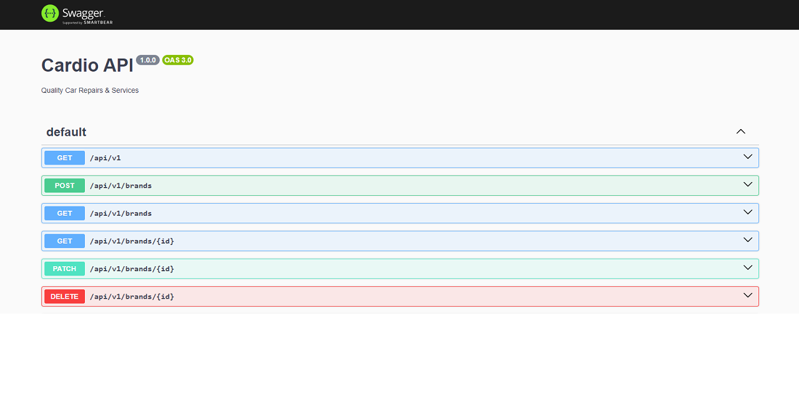

# Cardio API

Quality Car Repairs & Services

[](https://docs.nestjs.com/)
[](https://www.typescriptlang.org/docs/)


## Installation

```
$ git clone https://github.com/2gbeh/cardio-api.git

$ cd cardio-api

$ npm install

$ npm run start:dev
```

###### (if nest required)

```
$ npm i -g @nestjs/cli
```

## Usage

> Local:   http://localhost:8000/api/v1/docs

## Documentation


